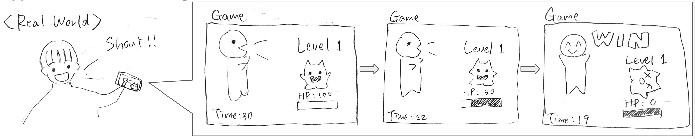

# Louder is Stronger

## プロジェクトの概要
本プロジェクトは、スマホのセンサーを使って情報を計測し、取得した情報を何らかの形で活用するAndroidアプリを作成することを目標とします。アプリの設計には、Unityを使用する予定です。

## 現時時点でのアプリのアイデア
「**声をたくさん出して敵を倒す！**」そんな感じのゲームを考えています。



## アプリ設計の流れ

具体的には、

1. アプリを起動
2. 敵が出現
3. 声を出す
4. 声をダメージに変換して敵のHPを減らす
5. 3・4を繰り返し敵のHPが0になったら勝利

の５ステップが最低限実装しなければいけない機能です。ただし、最初からすべての機能を実装することはできないため、最初のステップは

1. スマホのマイクを使って音を拾う
2. 音の大きさ・長さに閾値を設定し、閾値を超えたことを判定する（```Debug.Log```など）
3. 判定できるようになったら、閾値を超えた回数を記録してダメージの概念を実装

の３つになります。

## 他からもらったアイデア・追加機能案

### ダメージ計算について

* ダメージ計算のバリエーションを増やす
    * 高い声
    * ビブラート
* 敵に弱点を設ける
    * 低い声に弱い敵、など

Unity上で音声をどれだけ扱えるかが未知数ですが、時間が許せばこのあたりは実装できそうです。

### ゲームのロジックについて

* 敵を倒すごとに簡単なストーリーを進めるなど、RPG的要素の追加

これも時間次第でしょう。ノベルゲーム風に簡単な作りにすることはある程度可能そうです。

### ゲームの外観について

* 敵と1対1で戦うのではなく、周囲から敵が近づいてくる方式
    * 声を出すと近づいた敵が吹っ飛ぶといった設計で爽快感⤴︎
    * スマホの回転（ジャイロセンサー）に合わせてキャラクターを移動させるような設計
    
こちらはアイデアとしては面白いですが、実装するとなるとマップの概念や敵ごとのダメージ計算、接触判定などが難しいので余裕があれば、といった感じでしょう。